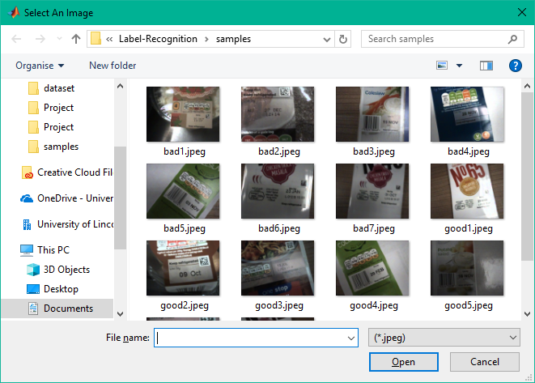
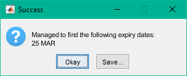

# Label Recognition

Label Recognition is a MATLAB script which implements an expiry date detection and recognition algorithm. It is capable of recognising expiry dates within a supplied image and allows the text to be saved to a file. 

## Installation

MATLAB 2018b is required to execute this software. You may need to purchase a [license](https://uk.mathworks.com/pricing-licensing.html).

Afterwards, clone the repository using:

```bash
git clone https://github.com/turnerdaniel/Label-Recognition
```

## Usage

Open the MATLAB IDE. Ensure that the directory containing ```script.m``` is selected as the current folder. 

Enter the the following in the Command Window:

```
script
```
Import an image using the file selection window.



View the detected dates.



## Author

Daniel Turner - [turnerdaniel](https://github.com/turnerdaniel/)